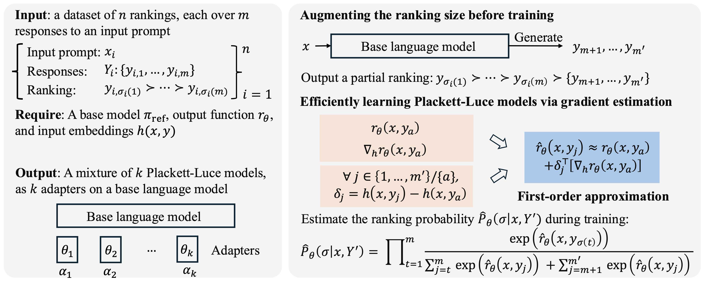

# Learning Mixtures of Plackett-Luce Models for Preference Optimization

This repository contains the code for reproducing the main experiments of **MoPLEx**, a method for learning mixtures of Plackett-Luce ranking models from heterogeneous preference data.

* Authors: [Dongyue Li](lidongyue12138.github.io), [Ziniu Zhang](ziniuzhang.github.io), [Lu Wang](https://web.eecs.umich.edu/~wangluxy/), and [Hongyang R. Zhang](www.hongyangzhang.com).



The main experiments report clustering and ranking accuracy on:

- [UltraFeedback](https://huggingface.co/datasets/openbmb/UltraFeedback) disagreement data
- [PERSONA-12](https://huggingface.co/datasets/SynthLabsAI/PERSONA) heterogeneous-user data

## Usage

Here is the procedure to reproduce the main results. First, we introduce how to construct the environment. Then, we give detailed instructions of how to implement our method and baselines on UltraFeedback and PERSONA-12 datasets.

### Environment reconstruction

We use Python 3.10 for all the experiments.
```bash
pip install -r requirements.txt
cd src
pip install -e .
```

### Experiment on UltraFeedBack

1. Generate UltraFeedback disagreement data

```bash
bash scripts/bash_scripts/generate_disagreement_ultrafeedback_dataset.sh
```

MoPLEx uses augmented ranking slates with generated tail responses. Generate the augmented training data with:

```bash
bash scripts/bash_scripts/augment_ultrafeedback_disagreement/augment_train_downsampled_ultrafeedback_disagreement_0.25.sh
```

2. Run MoPLEx on UltraFeedback

This command runs the main mixture-of-PL model with block EM, per-cluster LoRA adapters, response augmentation, and linear reward approximation.

```bash
bash scripts/bash_scripts/evaluate_ultrafeedback_disagreement/run_mixture_pl_linear_approx_qlora_ultrafeedback_disagreement_original_augmented.sh
```

For the non-approximated original-slate variant:

```bash
bash scripts/bash_scripts/evaluate_ultrafeedback_disagreement/run_mixture_pl_qlora_ultrafeedback_disagreement_original.sh
```

3. Run UltraFeedback baselines

We implement the following baselines: [DPO](https://github.com/eric-mitchell/direct-preference-optimization), [LiPO](src/src/alignment/listwise_dpo.py), [MiCRo](https://github.com/uiuctml/MiCRo), [MaxMin-RLHF](https://github.com/CharlesQ9/MaxMinRLHF), and [EM-DPO](src/src/alignment/em-dpo.py).

```bash
# DPO:
bash scripts/bash_scripts/evaluate_ultrafeedback_disagreement/run_dpo_qlora.sh

# LiPO / single listwise PL model:
bash scripts/bash_scripts/evaluate_ultrafeedback_disagreement/ablations/run_single_pl_qlora_ultrafeedback_disagreement_all_criteria.sh

# MiCRo:
bash scripts/bash_scripts/evaluate_ultrafeedback_disagreement/run_micro_cluster.sh

# MaxMin-RLHF:
bash scripts/bash_scripts/evaluate_ultrafeedback_disagreement/run_maxmin_cluster.sh

# EM-DPO:
bash scripts/bash_scripts/evaluate_ultrafeedback_disagreement/run_emdpo_cluster.sh
```

### Experiment on PERSONA-12

1. Generate PERSONA-12 data

```bash
bash scripts/bash_scripts/evaluate_persona/generate_persona_subset.sh
```

2. Run MoPLEx on PERSONA-12

```bash
bash scripts/bash_scripts/evaluate_persona/run_persona_12_mixture_pl_linear_approx_response_sweep.sh
```

3. Run PERSONA-12 baselines

```bash
# DPO:
bash scripts/bash_scripts/evaluate_persona/run_persona_12_dpo.sh

# LiPO / single listwise PL model:
bash scripts/bash_scripts/evaluate_persona/run_persona_12_listpo.sh

# MiCRo:
bash scripts/bash_scripts/evaluate_persona/run_persona_12_micro_cluster.sh

# MaxMin-RLHF:
bash scripts/bash_scripts/evaluate_persona/run_persona_12_maxmin_cluster.sh

# EM-DPO:
bash scripts/bash_scripts/evaluate_persona/run_persona_12_emdpo_cluster.sh
```

## Project structure

```text
MMPO-code/
├── README.md
├── requirements.txt
└── src/
    ├── src/alignment/                  # mixture PL, ListDPO, MoPLEx trainers
    ├── scripts/dpo.py                  # main TRL training entry point
    ├── scripts/bash_scripts/           # experiment launch scripts
    │   ├── evaluate_ultrafeedback_disagreement/
    │   ├── evaluate_persona/
    │   └── augment_ultrafeedback_disagreement/
    ├── recipes/                        # QLoRA and training configs
    ├── data/                           # generated datasets
    └── outputs/                        # checkpoints and logs
```

## Main metrics

The scripts log metrics to Weights & Biases and write checkpoints under `src/outputs/`.

For the main table, report the mean and standard deviation over three seeds:

- Clustering accuracy: aligned mixture posterior / cluster assignment accuracy
- Ranking accuracy: validation top-1 or pairwise ranking accuracy

## Reference

If you find this repository useful or happen to use it in a research paper, please cite our work with the following Bib information.

```bibtex
@inproceedings{li2026learning,
  title={Learning Mixtures of Plackett-Luce Models for Multi-Objective Alignment},
  author={Li, Dongyue and Zhang, Ziniu and Wang, Lu and Zhang, Hongyang R.},
  booktitle={Conference on Empirical Methods in Natural Language Processing (EMNLP)},
  year={2026}
}
```
